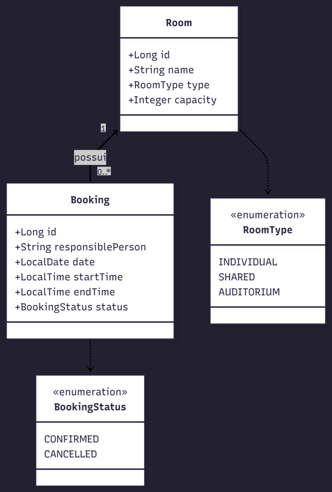

# Coworking Booking API

Uma API RESTful robusta desenvolvida para gerir o cadastro e a reserva de salas num espaço de coworking. O sistema garante a integridade da agenda, prevenindo conflitos de horários através de regras de negócio validadas, e foi construído com foco em boas práticas de engenharia de software e arquitetura limpa.


## Estrutura do Projeto

O projeto segue uma arquitetura em camadas típica de Spring Boot: **Controller → Service → Repository → Model**, com DTOs para entrada de dados, tratamento centralizado de exceções e testes separados por camada.

```
booking-api/
├── docs/                               
│   └── diagrama-classes-coworking-api.png     # Modelagem de domínio
├── .mvn/
│   └── wrapper/
│       └── maven-wrapper.properties   
├── k8s/                               # Manifestos do Kubernetes (PoC)
│   ├── deployment.yaml                # Manifesto Kubernetes (Deployment)
│   └── service.yaml                   # Manifesto Kubernetes (Service/LoadBalancer)
├── src/
│   ├── main/
│   │   ├── java/com/coworking/bookingapi/
│   │   │   ├── BookingApiApplication.java   # Classe principal da aplicação
│   │   │   ├── config/
│   │   │   │   └── OpenApiConfig.java      # Configuração do Swagger/OpenAPI
│   │   │   ├── controller/
│   │   │   │   ├── BookingController.java  # Endpoints REST de reservas
│   │   │   │   └── RoomController.java     # Endpoints REST de salas
│   │   │   ├── dto/
│   │   │   │   ├── BookingRequestDTO.java  # DTO de entrada para reservas
│   │   │   │   └── RoomRequestDTO.java     # DTO de entrada para salas
│   │   │   ├── exception/
│   │   │   │   └── GlobalExceptionHandler.java  # Tratamento global de erros
│   │   │   ├── model/
│   │   │   │   ├── Booking.java            # Entidade JPA de reserva
│   │   │   │   ├── BookingStatus.java      # Enum de status da reserva
│   │   │   │   ├── Room.java               # Entidade JPA de sala
│   │   │   │   └── RoomType.java           # Enum de tipo de sala
│   │   │   ├── repository/
│   │   │   │   ├── BookingRepository.java  # Acesso a dados de reservas
│   │   │   │   └── RoomRepository.java     # Acesso a dados de salas
│   │   │   └── service/
│   │   │       ├── BookingService.java     # Regras de negócio de reservas
│   │   │       └── RoomService.java        # Regras de negócio de salas
│   │   └── resources/
│   │       ├── application.yml             # Configuração padrão (H2 em memória)
│   │       └── application-prod.yml        # Configuração de produção (PostgreSQL)
│   └── test/
│       └── java/com/coworking/bookingapi/
│           ├── BookingApiApplicationTests.java  
│           ├── controller/
│           │   └── RoomControllerTest.java      # Testes de integração (MockMvc)
│           └── service/
│               ├── BookingServiceTest.java      # Testes unitários de reservas
│               └── RoomServiceTest.java         # Testes unitários de salas
├── .gitattributes
├── .gitignore
├── docker-compose.yml                 # PostgreSQL para ambiente local/prod
├── HELP.md                            
├── mvnw                               
├── mvnw.cmd                           
├── pom.xml                            
└── README.md
```

## Modelagem do Domínio

Abaixo está o diagrama de classes que ilustra as entidades principais do sistema e seus relacionamentos:




## Tecnologias e Ferramentas

- **Java 17 & Spring Boot 4.0.6:** Base do desenvolvimento backend.
- **Spring Data JPA & Hibernate:** Persistência de dados.
- **Lombok:** Redução de código boilerplate e injeção de dependências limpa.
- **H2 Database ou PostgreSQL:** Base de dados em memória (H2) para testes e desenvolvimento rápido, e PostgreSQL preparado para o ambiente de produção via Docker.
- **JUnit 5 & Mockito & MockMvc:** Testes unitários e de integração.
- **Springdoc OpenAPI (Swagger):** Documentação interativa e viva da API.
- **Docker & Docker Compose:** Conteinerização da aplicação e base de dados.
- **Kubernetes (K8s):** Manifestos para orquestração em ambiente Cloud.

---

## Como Executar o Projeto Localmente

### Opção 1: Via IDE (Padrão)
A forma mais simples. O projeto está configurado para utilizar uma base de dados H2 em memória por padrão.
1. Clone o repositório: `https://github.com/caiojulio/booking-api`
2. Abra o projeto na sua IDE preferida (IntelliJ, Eclipse, VS Code).
3. Execute a classe principal `BookingApiApplication.java`.
4. A API estará disponível na porta `8080`.

### Opção 2: Base de Dados Real via Docker (PostgreSQL)
Se você deseja testar a aplicação simulando um ambiente real de produção, utilizaremos o Docker para prover a base de dados PostgreSQL e o Maven para executar a API conectada a ela.

⚠️ **Atenção aos Pré-requisitos:** Certifique-se de que o **Docker** e o **Docker Compose** estejam instalados e, fundamentalmente, que o **Docker Engine esteja ativo** (rodando em background) na sua máquina antes de prosseguir.

**Passo a passo:**

1. **Suba o Banco de Dados:**
   Abra o seu terminal na raiz do projeto e execute o comando abaixo para iniciar o contêiner do PostgreSQL:

   ```
   docker-compose up
   ```

   *(Dica: Este terminal ficará ocupado exibindo os logs do banco de dados. Não o feche e deixe-o rodando!)*

2. **Inicie a Aplicação (API):**
   Abra um **novo terminal** (também na raiz do projeto) e execute a aplicação injetando o perfil de produção (`prod`), que orienta o Spring Boot a ignorar o banco em memória e conectar-se ao Docker:

   ```
   ./mvnw spring-boot:run "-Dspring-boot.run.profiles=prod"
   ```

   *(Nota de compatibilidade: O uso das aspas no parâmetro garante que o comando funcione perfeitamente em qualquer sistema operacional e terminal, incluindo o Windows PowerShell).*

3. **Pronto para Uso!**
   Assim que o terminal exibir a mensagem de sucesso de inicialização, a sua API estará ativa e conectada ao banco real. Acesse a documentação interativa para realizar seus testes:
   * **Swagger UI:** [http://localhost:8080/swagger-ui/index.html](http://localhost:8080/swagger-ui/index.html)

---

## Decisões Arquiteturais

Para garantir a qualidade, manutenção e alinhamento com as necessidades do negócio, foram tomadas as seguintes decisões de desenho:

1. **Idioma do Código e Domínio:** O código-fonte (classes, variáveis, métodos) foram escritos em **Inglês**, respeitando o padrão global da indústria. No entanto, as mensagens de retorno da API (Exceptions, validações de DTO) e as descrições dos testes (`@DisplayName`) foram mantidas em **Português** para refletir o idioma nativo do negócio e dos utilizadores finais.
2. **Arquitetura Limpa e Isolamento de Responsabilidades:** O projeto segue uma separação rigorosa de camadas. Os `Controllers` atuam exclusivamente na recepção de requisições via DTOs, delegando toda a conversão de entidades e validação de negócio para a camada de `Service`. A injeção de dependências é feita via construtor utilizando a biblioteca Lombok.
3. **Prevenção de Conflitos (BookingService):** A validação de disponibilidade da sala foi centralizada na camada de serviço, utilizando uma *query* nativa no repositório para garantir que não existem sobreposições de horários de forma transacional (`@Transactional`).
4. **Infraestrutura como Código (K8s PoC):** O projeto utiliza o `docker-compose` como ambiente oficial para avaliação local. A pasta `/k8s` foi incluída puramente como uma **Prova de Conceito (PoC)**, demonstrando como a aplicação seria orquestrada (Deployments e LoadBalancers) num ambiente real de Cloud (ex: AWS EKS, Google GKE), não sendo necessária a sua execução para avaliar este desafio.
